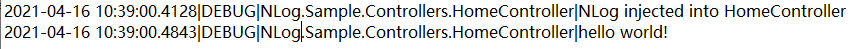

### Csp.Logger
`Csp.Logger`是之前想着如何不使用第三方日志框架把日志写到文件，.net core自带的只能输出到
`Console`，所以自己去网上搜刮整理：如何将.net core自带日志写到文件。

### 注意
Csp.Logger是自己兴趣捣鼓，要是大项目生产环境上建议还是慎用。
这里推荐一些第三方常用的一些日志框架：NLog、log4net、Serilog等。
当然选择还得看大伙自己熟悉的框架，这样上手快。毕竟没必要在这花时间
成本，项目上那么多的任务，还花时间在上面不值得。

在.net framework一直用log4net，后来网上看了一下，很多用NLog，
所以在.net core上我选择了NLog，NLog和log4net 使用上差不太多，
很多api都相似。

### 最后
由于这个写的很久了，当时一心想怎么将日志写到文件，参考了好多博客，
这里也感谢乐于分享的博主。

后面要是有时间，可以把整个思路记录下。

以下内容是NLog最小使用，具体详细的内容参考官方文档。

### NLog的使用
1、添加NLog库
>Install-Package NLog.Web.AspNetCore -Version 4.12.0

2、创建nlog.config文件
在项目上只要配置1个或多个nlog.config文件，nlog才会产生输出。下而是最小化nlog配置

``` xml
<?xml version="1.0" encoding="utf-8" ?>
<nlog xmlns="http://www.nlog-project.org/schemas/NLog.xsd"
      xmlns:xsi="http://www.w3.org/2001/XMLSchema-instance">

	<targets>
		<target name="logfile" xsi:type="File" fileName="log\nlog-${shortdate}.log" />
	</targets>

	<rules>
		<logger name="*" minlevel="Trace" writeTo="logfile" />
	</rules>
</nlog>
```

3、更新Program


``` C#
public class Program
{
    public static void Main(string[] args)
    {
        CreateHostBuilder(args).Build().Run();
    }

    public static IHostBuilder CreateHostBuilder(string[] args) =>
        Host.CreateDefaultBuilder(args)
            .ConfigureWebHostDefaults(webBuilder =>
            {
                webBuilder.UseStartup<Startup>();
            }).ConfigureLogging(logging => {
                logging.ClearProviders();
                logging.SetMinimumLevel(LogLevel.Trace);
            }).UseNLog();
}
```

4、配置appsettings.json 或 appsetttings.Development.json

``` json
{
  "Logging": {
    "LogLevel": {
      "Default": "Trace",
      "Microsoft": "Warning",
      "Microsoft.Hosting.Lifetime": "Warning"
    }
  }
}
```

把Default的LogLevel改为`Trace`

5、写日志

``` C#
using Microsoft.AspNetCore.Mvc;
using Microsoft.Extensions.Logging;

public class HomeController : Controller
{
    private ILogger<HomeController> logger;

    public HomeController(ILogger<HomeController> logger)
    {
        this.logger = logger;
        this.logger.LogDebug(1, "NLog injected into HomeController");
    }

    public IActionResult Index()
    {
        logger.LogDebug("hello world!");
        return View();
    }
}
```


6、输出



7、与 `LogDashboard` 结合使用

`LogDashboard`提供了一个可以简单快速查看日志的面板。下面是具体使用情况：

7.1、修改配置文件
配置文件需要分隔符才可以被 `LogDashboard` 解析，默认是 || 与 `||end`

``` xml
<?xml version="1.0" encoding="utf-8" ?>
<nlog xmlns="http://www.nlog-project.org/schemas/NLog.xsd"
      xmlns:xsi="http://www.w3.org/2001/XMLSchema-instance">

	<targets>
		<target name="logfile" xsi:type="File" fileName="log\nlog-${shortdate}.log" layout="${longdate}||${level}||${logger}||${message}||${exception:format=ToString:innerFormat=ToString:maxInnerExceptionLevel=10:separator=\r\n}||end" />
	</targets>

	<rules>
		<logger name="*" minlevel="Trace" writeTo="logfile" />
	</rules>
</nlog>
```

7.2、安装`LogDashboard`

> Install-Package LogDashboard

7.3、修改`Startup.cs`

``` c#
public void ConfigureServices(IServiceCollection services)
{
    services.AddLogDashboard();
}
```

``` c#
public void Configure(IApplicationBuilder app, IHostingEnvironment env)
{
    if (env.IsDevelopment())
    {
        app.UseDeveloperExceptionPage();
    }

    app.UseLogDashboard();

    app.Run(async (context) =>
    {
        await context.Response.WriteAsync("Hello World!");
    });
}
```

7.4 运行项目，在浏览器中导航到 `/logdashboard`